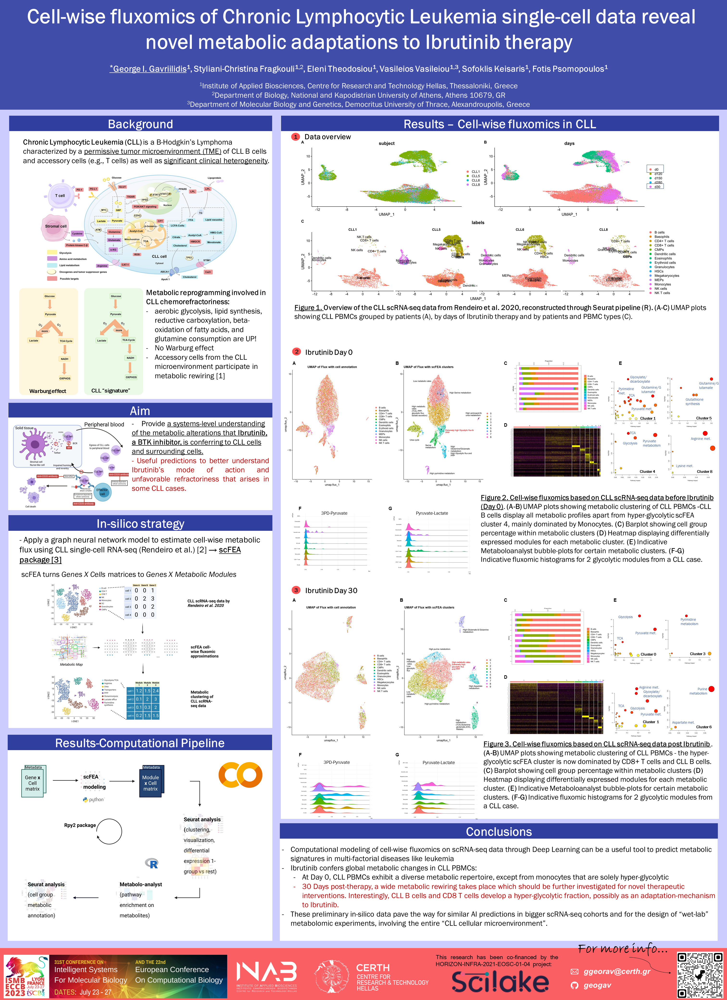

# Cell-wise fluxomics of Chronic Lymphocytic Leukemia single-cell data reveal novel metabolic adaptations to Ibrutinib therapy

This is the repository for the analysis that was presented as poster in the **31st Conference in Intelligent Systems For Molecular Biology and the 22nd European Conference On Computational Biology (ISΜB-ECCB23)**, Lyon, France.

## Abstract
Although the clinical efficacy of Ibrutinib in Chronic Lymphocytic Leukemia (CLL) partly rests on metabolic alterations, (PMID:32581549), a systems-level understanding of these changes in CLL and surrounding cells is lacking. To address this, we analyzed publicly available scRNA-seq data from CLL blood samples  (Pre-Ibr., Post-Ibr 30 days; n=4 cases) (PMID:31996669) by designing a new pipeline using Seurat, SingleR cell-annotation tool, scFEA neural-networks (cell-wise fluxomics) (PMID:34301623) and MetaboAnalyst enrichment platform. scFEA converted the typical Genes X Cells matrices to Metabolic Modules x Cells matrices. Through PCA, UMAP, differential module fluxomics, and metabolite enrichment on the latter matrices, we detected suppression of TCA cycle and increases in glycolysis/Warburg effect and pyrimidine synthesis in post-Ibrutinib CLL B cells. Increased glycolysis was also dominant in post-treatment CD4/CD8 T cells, hematopoietic stem cells, megakaryocytes, and myeloid progenitors. Interestingly, enhanced purine synthesis and import of oxoglutarate/malate were enhanced in post-Ibrutinib CLL B and T cells. These preliminary in-silico findings point towards - insofar nascent - metabolic adaptations of CLL and adjacent cells post-Ibrutinib. The theranostic value of these early data merits further investigation considering novel metabolic biomarkers and the use of metabolic modulators in CLL cases with suboptimal Ibrutinib responses.

## Background
Chronic Lymphocytic Leukemia (CLL) is a B-Hodgkin’s Lymphoma characterized by a permissive tumor microenvironment (TME) of CLL B cells and accessory cells (e.g., T cells) as well as significant clinical heterogeneity.

## Discription of Pipeline

Our pipeline focuses on providing a systems-level understanding of the metabolic alterations that Ibrutinib, a BTK inhibitor, is conferring to CLL cells and surrounding cells.

Steps include:
1. 
2. 
3. 

## Installation
1. To install scFEA follow the intructions [here](https://github.com/changwn/scFEA#requirements-and-installation).
2. To create the conda environment that was used for the analysis run `conda env create -f environment.yml`

## Execution
Here follows the list of all scripts and their description:

`01` - This bach script 

- Input: 
							 
- Output: 

`02.sh` - This bash script 

- Input:
							 
- Output:

`scFEA_commands.sh` - This bash script calls scFEA tool to infere the flux values for all cells and modules.

- Input: 
							 
- Output: 

`flux_histograms.R` - This R script plots the histograms of flux of all cell types per module

- Input: flux file, barcodes and cell types, human module info file
							 
- Output: histograms of flux of all cell types per module

## Contribute

We welcome any sort of contribution!
If you have any developer-related questions, please open an issue.

## Citation
George Gavriilidis and Styliani-Christina Fragkouli and Eleni Theodosiou and Vasileios Vasileiou and Sofoklis Keisaris and Fotis Psomopoulos, *Cell-wise fluxomics of Chronic Lymphocytic Leukemia single-cell data reveal novel metabolic adaptations to Ibrutinib therapy*, 31st Conference in Intelligent Systems For Molecular Biology and the 22nd European Conference On Computational Biology (ISΜB-ECCB23), 2023, doi: TBA

